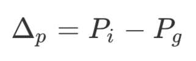
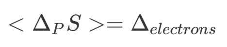
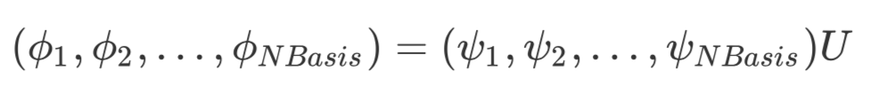
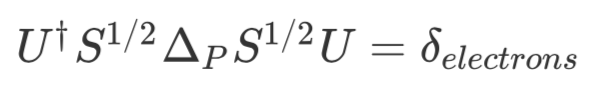
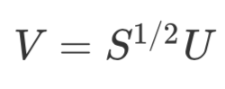

# Natural Ionization Orbitlals

### Introduction

A compact orbital representation of ionization processes is described utilizing the difference of calculated one-particle density matrices. Natural orbital analysis involving this difference density matrix simplifies interpretation of electronic detachment processes and allows differentiation between one-electron transitions and shake-up/shake-off transitions, in which one-electron processes are accompanied by excitation of a second electron into the virtual orbital space.

*J. Chem. Phys. 144, 204117, (2016)*

### Use of the NIO Program

```
>> python nio.py GroundState.fchk DetachedState.fchk
output: NIO-GroundState.fchk
```

### Theory

* Calculate difference 1- Particle Density Matrix

  

  Change in the number of electrons  can be computed

  

* Compute a set of orbitals, we term as **Natural Ionization Orbitals** (NIOs), from cannonical orbitals:

  

* The matrix U can be determined by solving the eigenvalue equation. The eigenvalues represent the occupation change number for each NIO

  

* The eigenvectors U can then be back transformed to the AO basis to give NIO coefficients V

  
